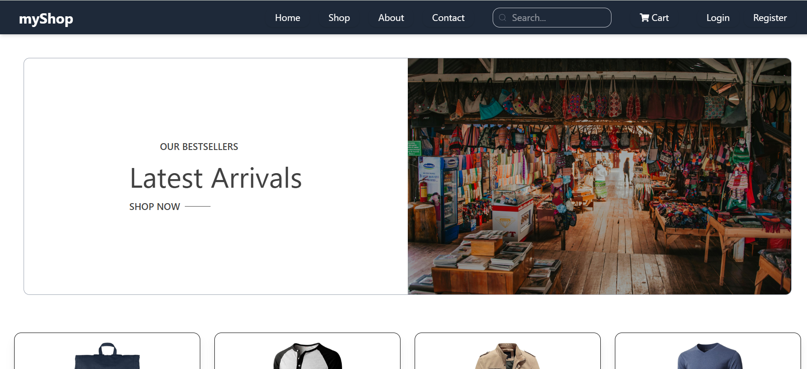
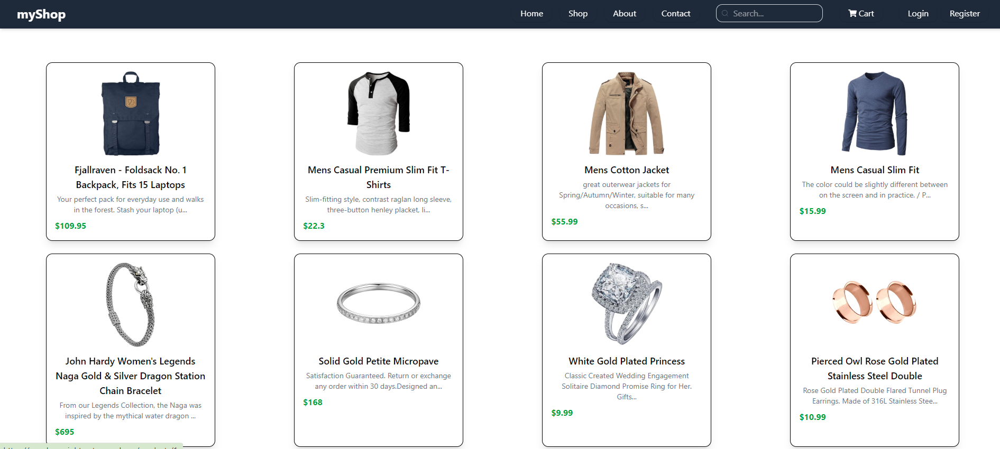
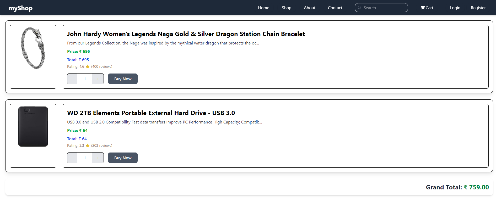
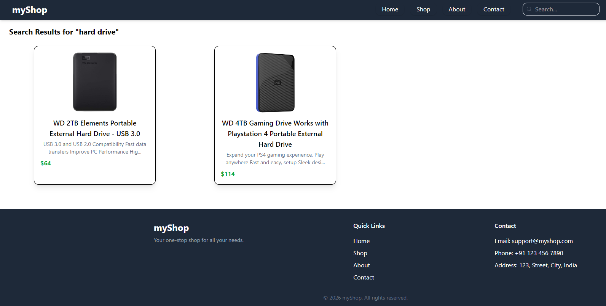
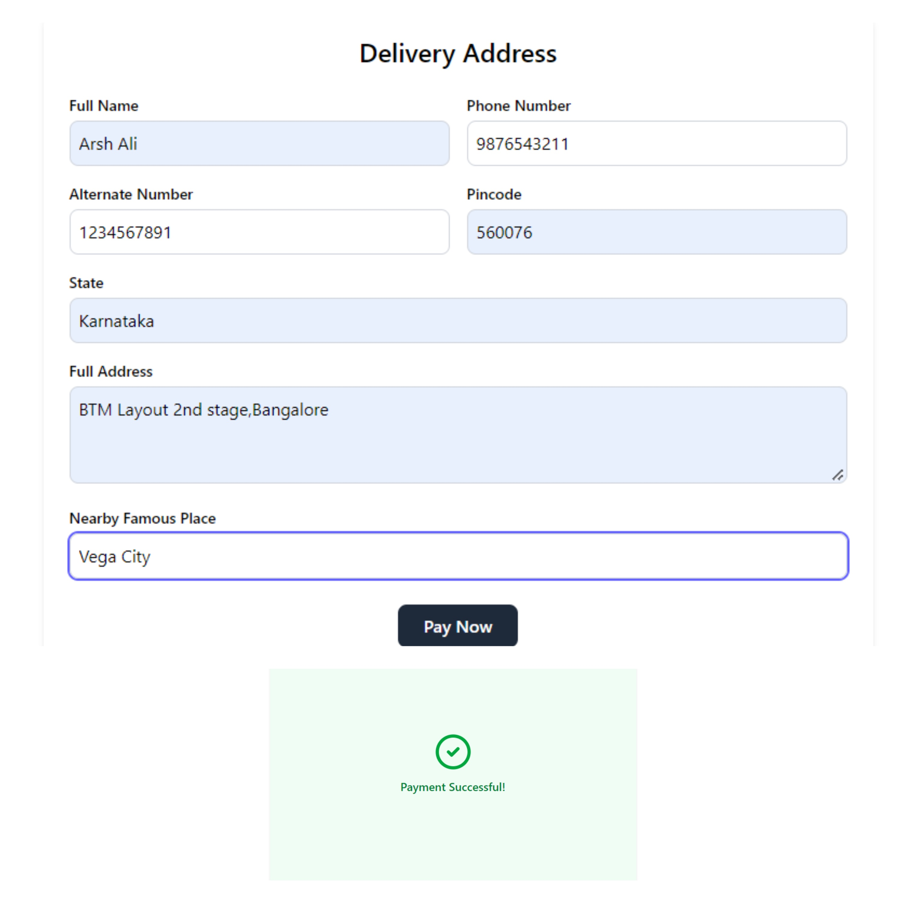

<div align="center">

# 🛍️ myShop

### A modern, responsive e-commerce web application built with React 19, Vite & Tailwind CSS


## 📖 Overview

**myShop** is a e-commerce application that delivers a smooth online shopping experience — from browsing and searching products to viewing details, managing a cart, and entering a delivery address.

The project is built with a **component-driven architecture**, uses the **Context API** for global state management, and relies on **client-side routing** for fast, seamless navigation. Styling is handled with **Tailwind CSS v4** and animations with **Framer Motion**, resulting in a clean, responsive and modern UI.

> 🎯 **Goal:** Demonstrate production-style frontend engineering — routing, state management, API integration, and responsive UI — in a real-world e-commerce scenario.

---

## 🌐 Live Demo

> 🔗 https://my-shop-eight-zeta.vercel.app/

---

## 📸 Screenshots

| Home Page | Product Details |
|:---:|:---:|
|  |  |

| Cart | Search Results |
|:---:|:---:|
|  |  |

| Payment |
|:---:|
|  |


---

## ✨ Features

- 🏠 **Landing / Hero page** with featured products and categories
- 📦 **Dynamic product details** page powered by route params (`/products/:id`)
- 🔍 **Product search** with dedicated results page (`/search/:term`)
- 🛒 **Shopping cart** with add / remove / quantity management
- 📍 **Address page** for entering delivery details
- 📬 **Contact** and **About** pages
- 🔔 **Toast notifications** for instant user feedback (`react-hot-toast`)
- 🎞️ **Smooth animations & transitions** (`framer-motion`)
- 🌐 **Global state management** using React **Context API**
- 📱 **Fully responsive** — mobile, tablet and desktop
- ⚡ **Lightning-fast development & builds** with Vite
- 🧹 **Clean, linted code** with ESLint (React Hooks + React Refresh rules)

---

## 🧰 Tech Stack

| Category | Technologies |
| --- | --- |
| **Frontend Library** | React 19 |
| **Build Tool** | Vite 7 |
| **Styling** | Tailwind CSS 4, `tailwind-scrollbar-hide` |
| **Routing** | React Router DOM 7 |
| **State Management** | React Context API |
| **HTTP Client** | Axios |
| **Mock Backend** | JSON Server |
| **Animations** | Framer Motion |
| **Icons** | Lucide React, React Icons |
| **Notifications** | React Hot Toast |
| **Code Quality** | ESLint 9 |

---

## 📂 Project Structure


myShop/
├── public/                    # Static assets
│
├── src/
│   ├── assets/                # Images, icons, and static resources
│   │
│   ├── components/            # Reusable UI components
│   │   ├── Navbar.jsx
│   │   └── Footer.jsx
│   │
│   ├── context/               # Global state management
│   │   └── AppState.jsx
│   │
│   ├── pages/                 # Route-level pages
│   │   ├── Hero.jsx
│   │   ├── ProductDetails.jsx
│   │   ├── SearchItem.jsx
│   │   ├── Cart.jsx
│   │   ├── Address.jsx
│   │   ├── About.jsx
│   │   └── Contact.jsx
│   │
│   ├── App.jsx                # Application routes and layout
│   ├── App.css                # Application-level styles
│   ├── index.css              # Global styles and Tailwind CSS
│   └── main.jsx               # Application entry point
│
├── screenshots/               # Project screenshots
│   ├── home.png
│   ├── product-details.png
│   ├── cart.png
│   ├── search.png
│   └── payment.png
│
├── .gitignore                 # Git ignored files
├── eslint.config.js           # ESLint configuration
├── index.html                 # HTML entry point
├── package.json               # Project dependencies and scripts
├── package-lock.json          # Dependency lock file
├── vite.config.js             # Vite configuration
└── README.md                  # Project documentation
```
```

## 🧭 Application Routes

| Route | Page | Description |
| --- | --- | --- |
| `/` | Hero | Home page with featured products |
| `/products/:id` | ProductDetails | Detailed view of a single product |
| `/search/:term` | SearchItem | Search results for the given term |
| `/cart` | Cart | Items added by the user |
| `/address` | Address | Delivery address form |
| `/about` | About | About the store |
| `/contact` | Contact | Contact information |

---

## 🚀 Getting Started

### Prerequisites

Make sure you have the following installed:

- **Node.js** `v18` or higher — [Download](https://nodejs.org/)
- **npm** `v9` or higher (comes with Node.js)
- **Git**

### Installation

**1. Clone the repository**

```bash
git clone https://github.com/<your-username>/myShop.git
cd myShop
```

**2. Install dependencies**

```bash
npm install
```

**3. Start the mock API (JSON Server)**

```bash
npx json-server --watch db.json --port 3000
```

> ℹ️ Adjust the file name and port to match your project's data file and the base URL used in your Axios calls.

**4. Start the development server** (in a new terminal)

```bash
npm run dev
```

The app will be available at **http://localhost:5173** 🎉

---

## 📜 Available Scripts

| Command | Description |
| --- | --- |
| `npm run dev` | Starts the Vite development server with HMR |
| `npm run build` | Creates an optimized production build in `dist/` |
| `npm run preview` | Serves the production build locally |
| `npm run lint` | Runs ESLint across the project |

---

## 🏗️ Architecture Highlights

- **Provider pattern** — `AppState` wraps the entire application in `main.jsx`, exposing shared state (products, cart, etc.) to any component without prop drilling.
- **Separation of concerns** — pages, reusable components, and state logic live in dedicated folders.
- **Declarative routing** — all routes are defined in one place (`App.jsx`) using React Router v7.
- **Utility-first styling** — Tailwind CSS v4 integrated through the official `@tailwindcss/vite` plugin.
- **Strict Mode enabled** — helps catch side-effects and unsafe patterns early in development.

---

## 🗺️ Roadmap

- [x] Product listing & details
- [x] Search functionality
- [x] Cart management
- [x] Address page
- [ ] User authentication (Login / Register)
- [ ] Protected routes
- [ ] Order placement & order history
- [ ] Payment gateway integration
- [ ] Wishlist
- [ ] Product filters & sorting
- [ ] Dark mode
- [ ] Unit & integration tests (Vitest + React Testing Library)

---

## 🤝 Contributing

Contributions, issues and feature requests are welcome!

1. **Fork** the project
2. Create your feature branch: `git checkout -b feature/amazing-feature`
3. Commit your changes: `git commit -m "feat: add amazing feature"`
4. Push to the branch: `git push origin feature/amazing-feature`
5. Open a **Pull Request**

---


## 👨‍💻 Author

**Arsh Ali**
B.Tech CSE - Jharkhand University of Technology

[
[
[

---

<div align="center">

⭐ **If you found this project helpful, please consider giving it a star!** ⭐


</div>
